# Procurement & Vendor Management System

A procurement and vendor management system (Purchase Request → Approval → Purchase Order → Goods Receipt) with budget control, audit logging, and notifications.

> NestJS + React + PostgreSQL — runs with a single Docker command

## Tech Stack

| Layer | Tools |
|---|---|
| Backend | NestJS 11 (TypeScript) + TypeORM |
| Database | PostgreSQL 16 |
| Cache / Rate-limit | Redis 7 (cache-aside + throttler storage) |
| Auth | JWT + bcrypt + Role Guard |
| API Docs | Swagger (OpenAPI) |
| Frontend | React 19 + Vite + Tailwind CSS + TanStack Query + React Hook Form + Zod |
| Testing | Jest + Supertest (backend), Vitest (frontend) |
| Infra | Docker + Docker Compose, nginx (load balancer), GitHub Actions CI |

## Features

- **Auth & Users** — JWT login, role-based access (employee / manager / procurement_officer), profile editing + password change
- **Purchase Request (PR)** — create/edit/submit for approval, state machine (draft → submitted → approved/rejected), select annual/quarterly budget
- **Vendor Management** — vendor CRUD, categories, blacklist, rating history
- **Purchase Order (PO) + GRN** — create a PO from a PR, record goods receipts (GRN), auto-complete the PO when fully received (DB transaction), rate vendors
- **Budget Control** — atomic reserve/release/consume of budgets (pessimistic lock)
- **Audit Log + Notification** — action logging + automatic notifications
- **Caching (Redis)** — cache-aside on reference data + vendor/rating lists, invalidate-on-write via a namespace generation counter, graceful degradation when Redis is down
- **Rate Limiting** — global throttle + auth-specific overrides (login/register/change-password), counters stored in Redis (multi-instance ready), fail-open when Redis is down
- **Load Balancing** — nginx round-robin across 2 backend instances (stateless + transparent failover), database migrations run once via a one-off service

## Screenshots

> The interface is in Thai (the system targets Thai procurement teams). Screenshots use the seeded demo data.

<p align="center">
  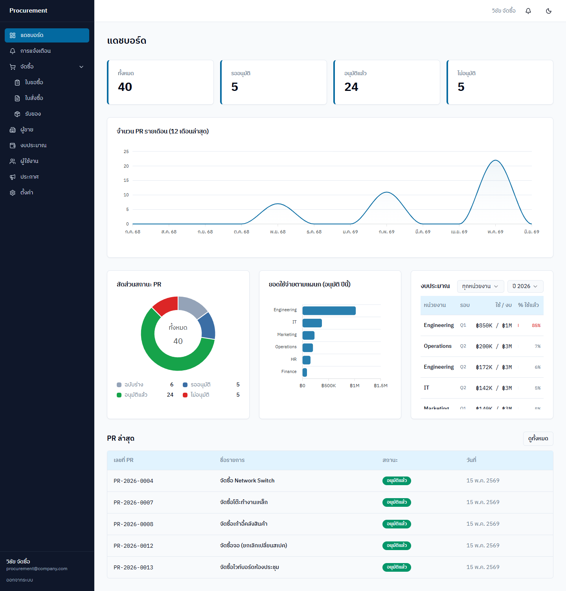<br>
  <sub><b>Dashboard</b> — monthly PR trend, status breakdown, per-department spend, budget utilization, and recent requests</sub>
</p>

### Real-time notifications

<p align="center">
  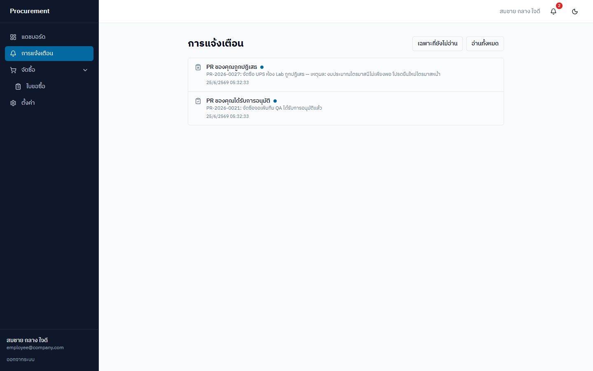<br>
  <sub><b>Notifications</b> — users are notified the moment their request is approved or rejected, pushed live over WebSocket (with an unread badge on the bell)</sub>
</p>

### Authentication & Account

<table>
  <tr>
    <td width="50%">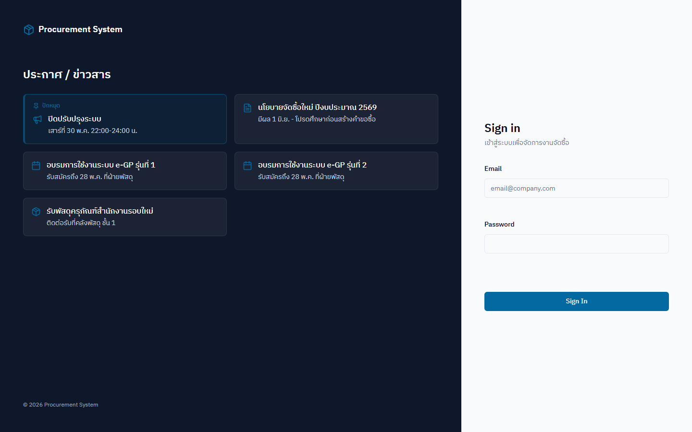<br><sub><b>Sign in</b> — split screen with a public announcements panel</sub></td>
    <td width="50%">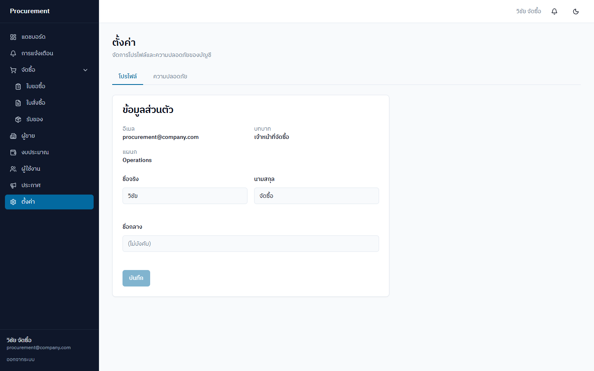<br><sub><b>Account</b> — profile editing and password change</sub></td>
  </tr>
</table>

### Purchase Requests

<table>
  <tr>
    <td width="50%">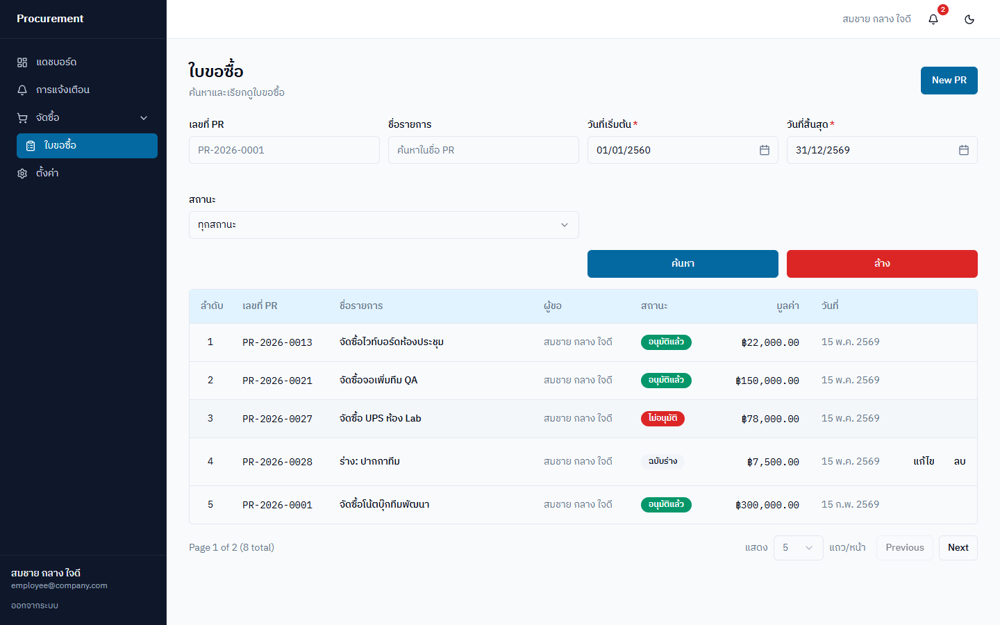<br><sub><b>List</b> — filter by number, name, date range, and status</sub></td>
    <td width="50%">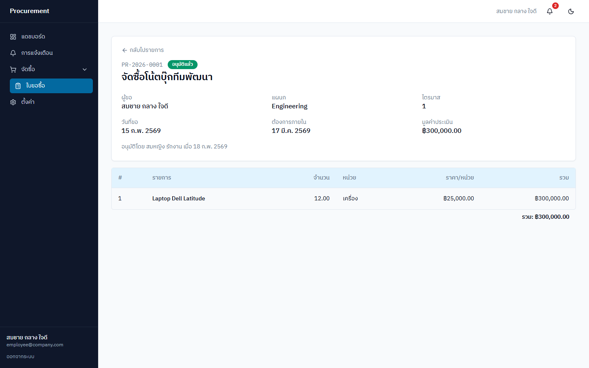<br><sub><b>Detail</b> — line items and totals</sub></td>
  </tr>
</table>

<p align="center">
  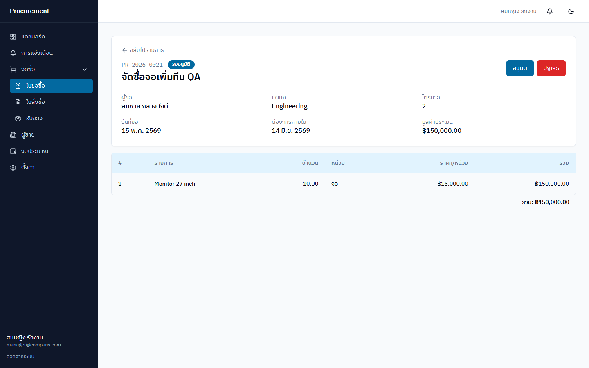<br>
  <sub><b>Approval</b> — a manager approves or rejects; budget is reserved on approval</sub>
</p>

### Purchase Orders & Goods Receipt

<table>
  <tr>
    <td width="50%">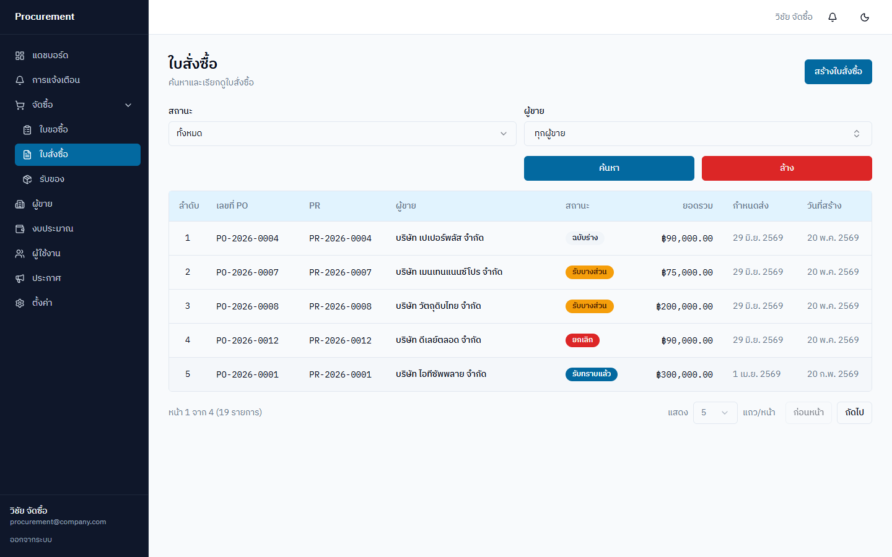<br><sub><b>PO list</b> — filter by status and vendor</sub></td>
    <td width="50%">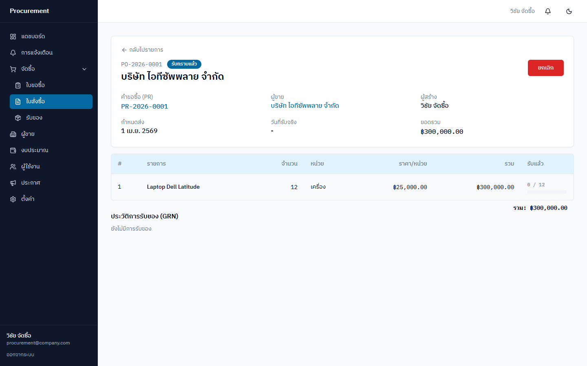<br><sub><b>PO detail</b> — per-line received progress and GRN history</sub></td>
  </tr>
</table>

<p align="center">
  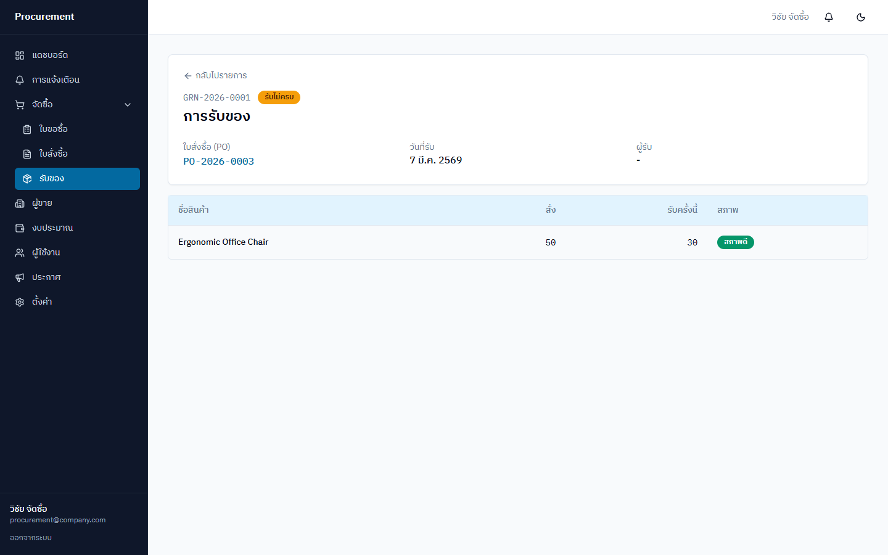<br>
  <sub><b>Goods receipt (GRN)</b> — ordered vs received with item condition; the PO auto-completes when fully received</sub>
</p>

### Vendor Management

<table>
  <tr>
    <td width="50%">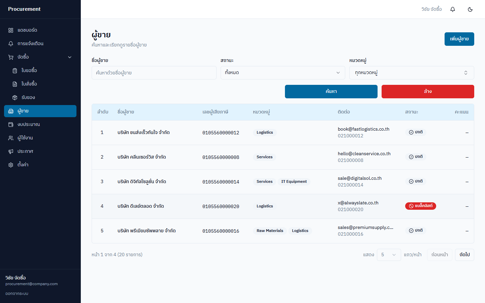<br><sub><b>List</b> — categories, status, and blacklist</sub></td>
    <td width="50%">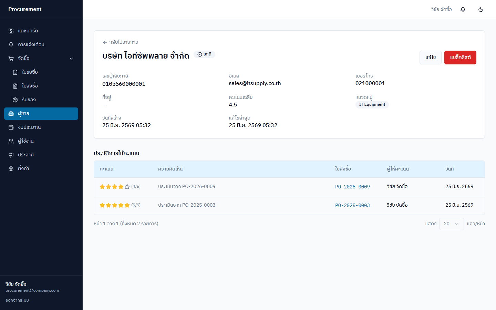<br><sub><b>Detail</b> — average rating and rating history linked to POs</sub></td>
  </tr>
</table>

### Budget Control

<p align="center">
  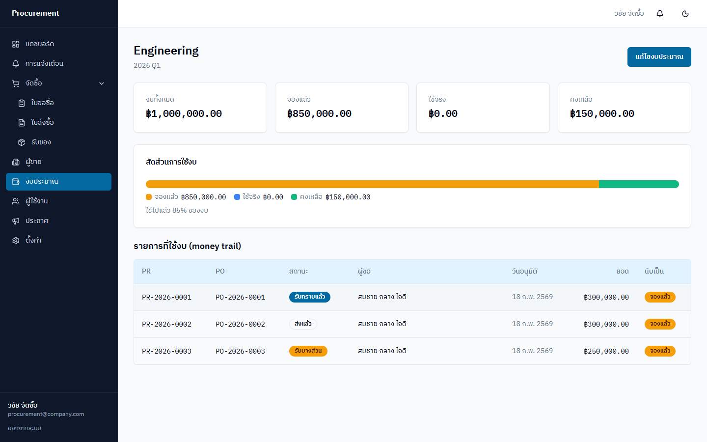<br>
  <sub><b>Budget</b> — total / reserved / consumed / remaining, with a money trail of the requests that consumed it</sub>
</p>

### User Management

<p align="center">
  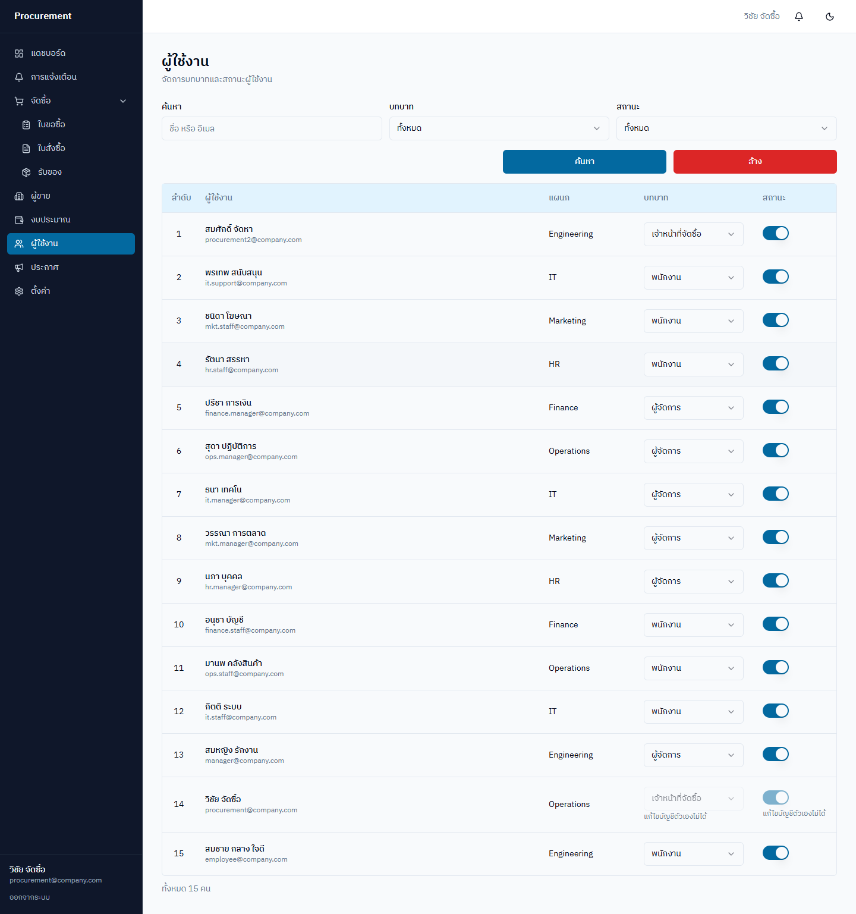<br>
  <sub><b>Users</b> — inline role assignment and active-status toggles</sub>
</p>

## Quick Start (Docker — recommended)

Requires Docker + Docker Compose

```bash
# 1. clone + enter the folder
git clone https://github.com/Chaiwat-Sadtho/Procurement-System.git
cd Procurement-System

# 2. create the env file
cp .env.example .env

# 3. run the full stack (prod-like: postgres + redis + migrate + backend1/backend2 + frontend)
docker compose -f docker-compose.yml up --build -d

# 4. seed sample data (run once after the first up)
docker compose -f docker-compose.yml exec backend1 npm run seed:prod
```

Access (everything goes through nginx on `:8080` — the backend does not publish a port outside the network):
- Frontend: http://localhost:8080
- Swagger API docs: http://localhost:8080/api/docs (nginx proxy → backend pool)
- Health check: http://localhost:8080/api/v1/health

### Test accounts (password: `Password123`)

| Email | Role |
|---|---|
| employee@company.com | employee |
| manager@company.com | manager |
| procurement@company.com | procurement_officer |

### Dev mode (with pgAdmin)

`docker compose up -d` (without `-f`) merges `docker-compose.override.yml`, adding pgAdmin at http://localhost:5050 (admin@admin.com / admin)

## Running without Docker (local dev)

**Database + Cache:** a running PostgreSQL is required (or `docker compose up -d postgres redis`) — Redis is optional in dev (cache + rate-limit degrade gracefully without it)

**Backend:**
```bash
cd backend
cp ../.env.example .env   # DB_HOST=localhost
npm install
npm run start:dev         # http://localhost:3000
npm run seed              # seed data (ts-node)
```

**Frontend:**
```bash
cd frontend
npm install
npm run dev               # http://localhost:5173 (proxies /api → :3000)
```

## Testing

```bash
# Backend
cd backend
npm run test              # unit
npm run test:e2e          # e2e (requires a DB)

# Frontend
cd frontend
npm run test:run          # vitest
```

## CI

GitHub Actions (`.github/workflows/ci.yml`) runs lint + test + build for both the backend (with a PostgreSQL service container for e2e) and the frontend on every push to `master` / `dev` and every Pull Request.

## Demo Flow

1. `docker compose -f docker-compose.yml up --build -d` + seed
2. Open Swagger at http://localhost:8080/api/docs to browse all APIs
3. Log in as employee → create a PR → submit
4. Log in as manager → approve the PR (budget is reserved)
5. Log in as procurement → create a PO from the PR → record a GRN → PO auto-completes + budget is consumed
6. Rate the vendor → view it on the vendor detail page

## Architecture

```
Browser ──http://localhost:8080──> [nginx + React SPA]   (frontend container)
                                          │
                                          │ proxy /api/*  (round-robin + transparent failover)
                                          ├──> [backend1 :3000] ─┐
                                          └──> [backend2 :3000] ─┤
                                                                 ├── TypeORM ──────────> [postgres :5432]
                                                                 └── cache / throttle ──> [redis :6379]

[migrate]  one-off service: runs DB migrations once before the backends start (prevents migration races)
```
